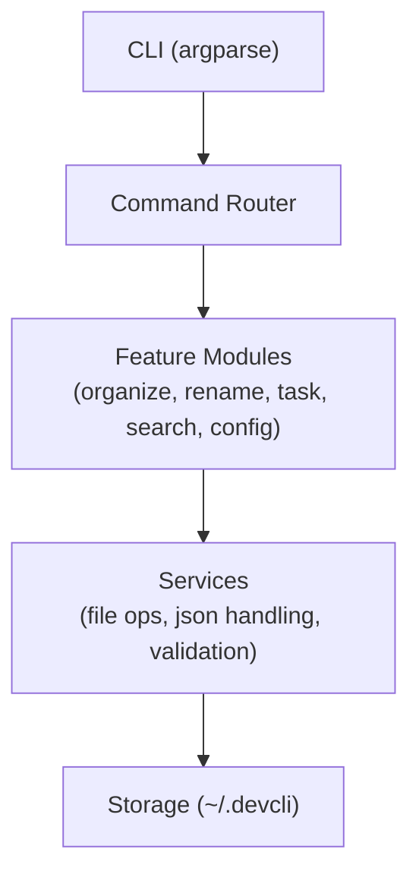

# **DEVELOPER PRODUCTIVITY CLI**

This document contains the feature definition for a custom developer productivity CLI. This CLI is aimed to improve the productivity of developers by helping them with day to day tasks like file handling, task managing etc.

The feature currently available are:

- File Organizing
- Custom File renaming
- Task Managing
- Search Tool
- Config Managing

**Detailed Description**

**Feature 1 : File Organizing**

**What it does :**

- Moves common files into single folder either by type or by extension.
- Organizes into the same folder by creating a sub folder by extension or type name.
- Preview changes before commiting by default can be overridden by --force flag.
- Ignores hidden files.

**Input :**

- **Command:**
  - **devcli organize** - without any arguments organizes same folder by extension, no files ignored except for hidden files, previews changes
- **Optional Arguments:**
  - **&lt;source&gt; (default = current dir)**
  - **&lt;destination&gt; (default = source)**
- **Flags:**
  - **\--by-type**
  - **\--by-extension**
  - **\--ignore &lt;extensions&gt; Eg:** \--ignore jpg png
  - **\--force**

**Output :**

- Preview changes by listing folders and files if no --force
- Confirm change option if no -force
- Displays summary:
- total files scanned
- moved
- skipped (with reasons)
- errors

**Edge Cases :**

- If two files with same name adds (1) numbering **Eg:** filename(n).extension.
- If files already in destination ie moved copy is present the skip the file.
- If source not found prints **"Path not found"** then exit.
- If destination not found creates destination directory (including parent directories) if it does not exist.
- If no mode given defaults to **-by-extension**
- If permission denied skip file and print **"File filename skipped - {error}"** to console and log into file.
- If both **-by-type** and **-by-extension** is set then inside type folder sub folders are created according to extensions.
- If no files found prints **"No files to organize"**

**Feature 2 : File Renaming**

**What it does :**

- Renames file or folder
- Renames files in the directory using flags mentioned below
- Previews changes if **-force** is unset.
- Change case

**Input :**

- **Command:**
  - **devcli rename**
- **Modes:**
  - **&lt;filename / foldername&gt; &lt;new name&gt; -** changes file or folder name
  - **&lt;foldername&gt; --name &lt;name&gt; \[flags\] -** changes all files according to the name and flags
- **Flags:**
  - **\--prefix**
  - **\--suffix**
  - **\--auto-number**
  - **\--uppercase**
  - **\--force**

**Output :**

- Preview changes by listing files if no --force
- Confirm change option if no -force
- Displays summary:
- total files renamed
- skipped (with reasons)
- errors

**Edge Cases:**

- If no arguments provided **Eg : devcli rename** prints error to console.
- Renaming file or folder should have **&lt;new name&gt;** and optional **-uppercase** and **-force** flags, any other flags will result in error.
- **&lt;new name&gt;** argument will rename file or folder and **-name** rename contents inside folder.
- **\--name** on file will result in error.
- **\--name** should be used with **-auto-number** else results in error.
- Order of transformation is **Base name (original OR --name) -> --uppercase ->** **-prefix -> --suffix -> --auto-number.**
- If **&lt;new name&gt;** and **\--name** are not provided, transformation flags are applied to existing filenames **Eg: devcli rename folder --prefix test\_.**

**Feature 3 : Task Manager**

**What it does :**

- Allows to add, edit delete or view tasks directly on command line.
- Allows to sort tasks using status or priority.
- Allows to set status and priority for tasks.
- Tasks are stored in a json file.
- Located at:
- ~/.devcli/tasks.json (Linux/macOS).
- equivalent user directory on Windows.

**Input :**

- **Command:**
  - **devcli task add &lt;task_name&gt; &lt;description&gt; \[flags\]**
  - **devcli task view \[--task-id &lt;id&gt;\]**
  - **devcli task remove &lt;task_id&gt;**
  - **devcli task edit &lt;task_id&gt; \[--name ... --description ... --priority ... --status ...\]**
  - **devcli task sort --by &lt;field&gt; --order &lt;asc / desc&gt;**
- **Required Arguments:**
  - **Add:**
  - **&lt;task name&gt;**
  - **&lt;description&gt;**
  - **Edit:**
  - **&lt;task id&gt;**
  - **\--name / --description / --status / --priority -** either one or all
  - **Remove:**
  - **&lt;task id&gt;**
  - **Flags:**
  - **\--priority -** to set priority as (H, M, or L)
  - **\--name -** to set name when editing task
  - **\--description -** to set description when editing task
  - **\--status -** to set status for a task (pending/ongoing/completed)
  - **\--by -** to sort task by field
  - **\--task-id -** to give id when viewing task by id.
  - **\--order -** to sort in ascending or descending
  - **\--force -** to remove task without confirmation

**Output :**

- Tasks are displayed as a table.
- Each task should display:
- ID, Name, Description, Priority, Status, Timestamp

**Task Schema:**

- **id -** int auto-increment
- **name -** string
- **description -** string
- **priority -** string, options = (L, M, H)
- **status -** string, options = (pending/ongoing/completed)
- **created_at -** timestamp

**Edge Cases:**

- If priority is not mentioned it will be default to M.
- If status is not mentioned it will be default to pending.
- If task list is empty prints **"No tasks found".**
- If task id is not found prints **"Invalid task id".**
- Duplicate task names are allowed.
- Only name, description, priority and status can be updated.
- Invalid status and priority results in error.
- If .devcli directory does not exist → create it then create tasks.json
- If no flags with edit then print **"No operation specified".**
- If **-by** is not given when sorting then sort by status **Pending -> Ongoing -> Completed**.
- Sorting only affects display and does not modify stored data.

**Feature 4 : Search Tool**

**What it does :**

- Allows searching files by filename, extension and size
- Allows searching task by name, status or priority
- Displays total number of results found

**Input :**

- **Command**:
  - **devcli search file \[--path &lt;path&gt;\] \[--name … --ext … --size …\]**
  - **devcli search task \[--name … --priority … --status\]**
- **Required Arguments:**
  - **File :**
    - **-name, --ext,** **-size ->** Atleast one or combination of all
  - **Task :**
    - **-name, --priority,** **-status ->** Atleast one or combination of all
- **Flags:**
  - **\--name -** To define name of the item to search (Common for both task and file)
  - **\--path -** To define path to search for files
  - **\--ext -** To define extension of file
  - **\--min-size -** To define the minimum size of the file for searching
  - **\--max-size -** To define the maximum size of the file for searching
  - **\--priority -** To define the priority of the task when searching
  - **\--status -** To define the status of the task when searching
  - **\--recursive -** To define whether to check for nested files or not
  - **\--limit -** To limit search results

**Output :**

- For files the table has the columns
  - Name, path, size
- For tasks same table as Feature 3
- Gives number of results

**Edge Cases :**

- If no arguments given with search file or search task, error message is printed
- If no path given on search file, it defaults to current folder
- **\--priority, --status** should only be given with task search.
- **\--min-size, --max-size, --ext, --recursive** should only be given with file search
- If path not found prints **"path not found"**
- If no search results found it returns **"No results found"**
- **\--name** performs substring match, is case insensitive
- **\--limit** default is no limit, returns all the results
- **\--recursive** default is non-recursive, does not check sub folders
- **\--min-size, --max-size** can be given in terms of KB, MB or GB
- **\--ext** should be given without '.' **Eg: jpg, png etc**
- When both **-min-size** and **-max-size** are used if **\--min-size > --max-size** then prints error

**Feature 5 : Config Manager**

**What it does :**

- Allows configuring default behavior for commands
- Helps to group commands to execute sequentially.
- CLI flags take highest priority, Config values act as defaults only
- Configs are stored as key value pairs
- Configs can be accessed using key
- Configs can be reset using feature name and reset command
- Configs and shortcuts are stored in a json file.
- Located at:
  - ~/.devcli/config.json (Linux/macOS).
  - ~/.devcli/shortcuts.json (Linux/macOS).
- equivalent user directory on Windows.
- Configs and shortcuts are stored as plain key value pairs in separate files
- Shortcut commands can be used to group two or more commands together which helps in executing multiple commands using a single command.
- Shortcut commands are executed in the current working directory

**Input :**

- **Command :**
  - **devcli config set &lt;key&gt; &lt;value&gt;**
  - **devcli config get &lt;key&gt;**
  - **devcli config delete &lt;key&gt;**
  - **devcli config view**
  - **devcli config reset &lt;feature&gt;**
  - **devcli shortcut add &lt;name&gt; "&lt;command sequence1 && command sequence2 && …&gt;"**
  - **devcli shortcut run &lt;name&gt;**
  - **devcli shortcut delete &lt;name&gt;**
  - **devcli shortcut get &lt;name&gt;**
  - **devcli shortcut view**

**Output :**

- Success message for config and shortcut creation
- get command returns the shortcut or config by their id (key in case of config and name in case of shortcut)
- shortcut run returns the status of each command sequence and returns success message if completed properly

**Edge Cases :**

- If any of the commands results in error in the command sequence, the error message is displayed and the process is terminated.
- If key or name is not found prints error message **"No such {config key or shortcut}"**
- If no shortcut.json or config.json is found, the files are created including parent directories if not present.
- If shortcut already exists print error **"Shortcut with same name exists".**
- **devcli config reset &lt;feature&gt;** Removes all config keys that start with &lt;feature&gt;.
- If no configs prints **"No configs found"**
- If no shortcuts **"No shortcuts found"**
- Key and value is must for config and key should be in the form **feature.flagname** and value should be the values accepted by that flag.
- If feature name or values are not valid **"Invalid feature or value"** is printed.
- Shortcut name and commands are required for add shortcut method else prints **"Invalid format".**
- Commands in shortcut should be combined with **&&** symbol.

# **System Structure**

The System consists of 5 layers:

- CLI layer which is implemented using **argparse** library
- Command Router layer which routes the commands to the respective feature.
- Feature layer which implements the logic of all the features
- Services layer which handles file handling, config storage etc
- Storage layer which stores all the data, config etc

# **Project Structure**

<pre>
devcli/
│
├── main.py
├── commands/   # organize, rename, task, search, config
├── services/   # file, json, validation, utils
├── models/     # task schema handling
├── storage/    # path + file handling
├── utils/      # helpers
└── tests/      # later
</pre>

